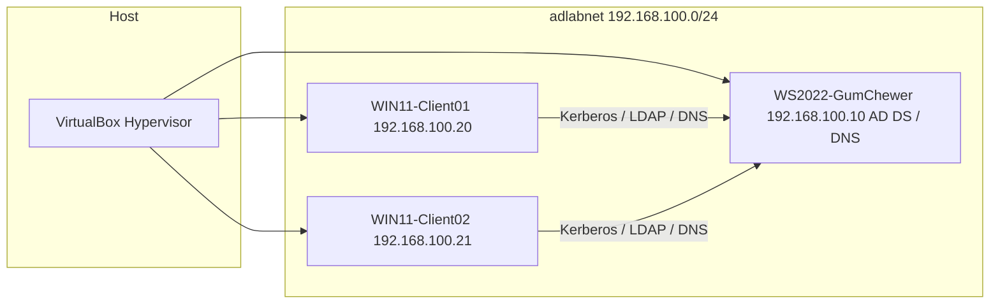

# GumChewer – Active Directory Home Lab

## Overview

This project documents the design and implementation of a Windows Server 2022 Active Directory lab built in VirtualBox. The lab includes one domain controller and two Windows 11 domain-joined clients. It was created to practice:

- Active Directory Domain Services (AD DS)
- DNS configuration
- OU structure and user management
- Group Policy deployment
- NTFS and share permission management
- Troubleshooting domain join and DNS issues

## Environment

### Host Specs
- OS: Microsoft Windows 11 Home (x64)
- CPU: AMD Ryzen 7 3700X
- Motherboard: MSI B450 TOMAHAWK MAX (MS-7C02)
- Memory: 2 x 16 GB DDR4 SDRAM
- GPU: AMD Radeon RX5700 XT
- Storage: 2 TB SATA HDD & 1 TB NVMe SSD

### Hypervisor
- Oracle VM VirtualBox

### Virtual Machine Configuration

#### Domain Controller
- OS: Windows Server 2022 (Desktop Experience)
- RAM: 8 GB
- CPU: 4 cores
- Disk: 80 GB (VDI, dynamically allocated)
- Network: Internal Network (adlabnet)
- Static IP: 192.168.100.10

#### Client 01
- OS: Windows 11 Pro
- RAM: 8 GB
- CPU: 4 cores
- Disk: 65 GB
- Network: Internal Network (adlabnet)
- Static IP: 192.168.100.20
- DNS: 192.168.100.10

#### Client 02
- OS: Windows 11 Pro
- RAM: 8 GB
- CPU: 4 cores
- Disk: 65 GB
- Network: Internal Network (adlabnet)
- Static IP: 192.168.100.21
- DNS: 192.168.100.10

## Network Design

All VMs were configured on an isolated Internal Network within VirtualBox to simulate a private enterprise LAN.

IP Scheme:
- Domain Controller: 192.168.100.10
- Client01: 192.168.100.20
- Client02: 192.168.100.21
- Subnet Mask: 255.255.255.0
- Default Gateway: Not configured (isolated lab)

## Troubleshooting Highlights

- Windows Server 2022 failed to mount partition during OS install.
- Installed CLI-only Windows Server 2022 OS by mistake (unattended install).
- Needed to bypass internet requirement duirng Windows 11 install on Clients to create local accounts.
- Locked out of Domain Controller by changing the computer name after promoting to domain controller.
- Could not join domain because created users were stored in the default AD container instead of custom OU. 
- Client desktop backgrounds failed to load due to NTFS and share permissions on the DC. 
- Group Policy not applying to clients due to improper config in AD and GPM. 

## Lessons Learned

- Unattended installs should be avoided to ensure proper OS setup. 
- Windows 11 internet requirements can be bypassed to create a local account on install.
- Only change the name of the Domain Controller before promoting the machine to Domain Controller. 
- The default Active Directory containers cannot be linked to group policies. 
- NTFS and share permissions need to both be configured to allow sharing over the domain network.
- Group Policy affecting the desktop background and access to control panel should be applied to the users and not the workstations.

## Future Improvements

- Implement DHCP role
- Configure roaming profiles
- Deploy software via GPO
- Implement security groups for role-based access control
- Simulate a helpdesk password reset workflow with delegated permissions